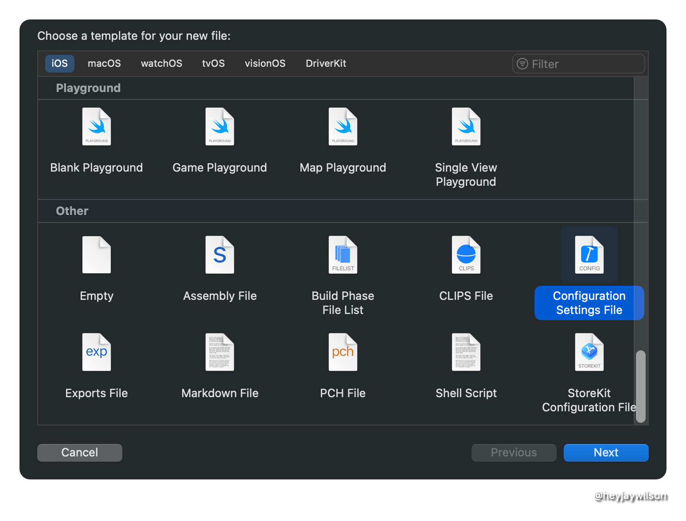
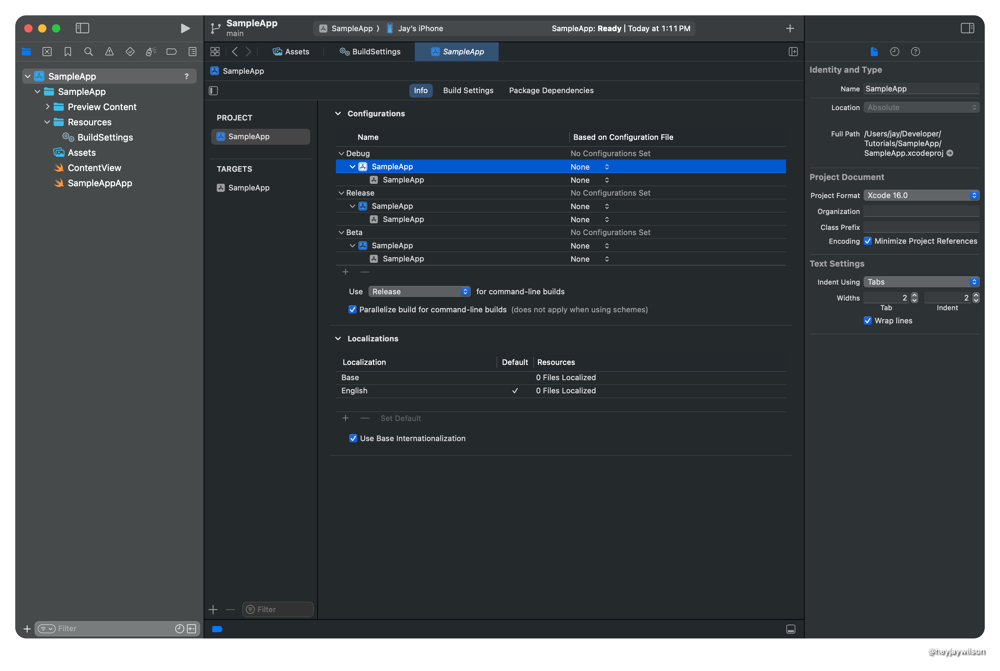
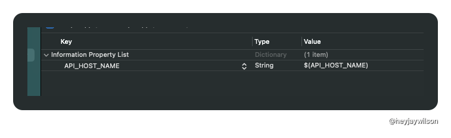

Xcode build configuration files, these end in `.xcconfig`, is another place to configure Xcode Build settings. The values set in here can be referenced in the project file. This article is going to show you how to set that up by configuring different bundle IDs and app icons. I'll also show how to access these values in code so that you can use it to define different API endpoints.

I have a sample project on my [GitHub](https://github.com/heyjaywilson/config-file-tutorial) that shows the basics of how to use the config files.

## What are Xcode Configuration Files

These files are text files that can be used to set your configurations (Debug and Release are included in iOS App projects) and allow you to access values based on the configuration selected.

The file is basically a bunch of keys (variable names) and values that will align to build settings. If you choose a key of a build setting, like `PRODUCT_BUNDLE_IDENTIFIER` it will overwrite that value in the Target settings since that value is looking for that build setting. 

>[!TIP] 
You can know if a parameter in Build Settings is looking for a key because it's value will look like this `$(SOME_VALUE)`.

## How to add a configuration file

I do this by right clicking on the folder I want to store these in, choosing `New File from Template`, and then choosing from `Configuration Settings File`. It's selected in the screenshot below.



When you make a new Configuration Settings File, there is a nifty comment so you can easily get more info

```
// Configuration settings file format documentation can be found at:
// https://help.apple.com/xcode/#/dev745c5c974
```

The `.xcconfig` file should not have a target. So let's remove the target membership from the file.

1. Open the inspector
2. Select the App from the Target Membership section
3. Hit delete on your keyboard or tap on the `-` button

### Setup the project to look at build files

Open the project settings by selecting the top level project name.



To assign the build settings file to the configurations:

1. Under the configuration choose the Project name that way it can be passed down to the targets in the project.
2. Where it says None, click there and choose the proper file
3. Repeat as needed for the remaining configurations

## Using the Config file

### Configure the bundle identifier

The [bundle identifier](https://developer.apple.com/documentation/bundleresources/information_property_list/cfbundleidentifier) is used to distinguish apps on the system. It must be unique and is usually in a reverse DNS format, example `com.heyjaycodes.{App_Name}`.

#### Config file
To run a dev, beta, and production version of the app on the same device you must have unique bundle identifiers for each configuration, so in the proper config file, you want to add something like the following

```
// Developer product identifier
PRODUCT_BUNDLE_IDENTIFIER = com.heyjaycodes.SampleApp.dev
// Beta product identifier
PRODUCT_BUNDLE_IDENTIFIER = com.heyjaycodes.SampleApp.beta
// Release product identifier
PRODUCT_BUNDLE_IDENTIFIER = com.heyjaycodes.SampleApp
```

Let me break down how this works.

`PRODUCT_BUNDLE_IDENTIFIER` is the variable that you'll reference in the code or project file.
`com.heyjaycodes.SampleApp.dev` is the value that's assigned to the variable.

That's a lot of repeating so you can also create a xcconfig file that holds common values and reference that in other xcconfig files. I like to call this file `Common`. I use it store pre fixes and suffixes.

If you go this route, you must include it in the file you want to reference it in using `#include file.xcconfig

```
// COMMON
PRODUCT_BUNDLE_IDENTIFIER_PREFIX = com.heyjaycodes.SampleApp
////////////////
//
// Developer file
#include "Common.xcconfig"

PRODUCT_BUNDLE_IDENTIFIER = $(PRODUCT_BUNDLE_IDENTIFIER_PREFIX).dev
////////////////
//
// Beta file
#include "Common.xcconfig"

PRODUCT_BUNDLE_IDENTIFIER = $(PRODUCT_BUNDLE_IDENTIFIER_PREFIX).beta
////////////////
//
// Release product file
#include "Common.xcconfig"

PRODUCT_BUNDLE_IDENTIFIER = $(PRODUCT_BUNDLE_IDENTIFIER_PREFIX)
```

### Configure App Icon

To configure different app icons, this takes a bit more work, but on the configuration side, you need to add a key for the app icon string and then set the value in the target's settings to that key. 

```
// COMMON
APP_ICON_PREFIX = AppIcon
////////////////
//
// Developer file
#include "Common.xcconfig"

APP_ICON = $(APP_ICON_PREFIX)-Dev
////////////////
//
// Beta file
#include "Common.xcconfig"

APP_ICON = $(APP_ICON_PREFIX)-Beta
////////////////
//
// Release product file
#include "Common.xcconfig"

APP_ICON = $(APP_ICON_PREFIX)
```

The value in the configuration values must match what's in the `Assets` file. In this example all of my app icons begin with AppIcon and then there is a suffix.

Now, go to the Target settings and search for App Icon in the Build Settings. You'll see a result for `Primary App Icon Set Name`. Change that value to `$(APP_ICON)` and once you hit Enter, you'll see that value change to `AppIcon-Dev`. If you double click on the value you'll see that it's still set to `$(APP_ICON)`. Xcode is just passing the value from the configuration file.

## Accessing values outside the configuration file

This file can also be really useful for setting variables that need to be different in the file like different servers and apis based on dev vs prod. There's one more step besides declaring those values in your file. You must also expose those files through the Info.plist.

Here's the value in my XCConfig file.

```
API_HOST_NAME = sampleappserver.heyjaycodes.com
```

In Info.plist, I need to add a new entry called `API_HOST_NAME` and reference the xcconfig file by `$(API_HOST_NAME)`. That might make a new Info.plist file, which is fine.



Now in code, you can access that host name by the following Swift code

```swift
guard let hostName = Bundle.main.object(forInfoDictionaryKey: "App_build_number") as? String else {
  print("🚨 NO HOST NAME SET IN Info.plist")
  return
}
```

You can also be a bit fancier and create a helper, but I'm not going to dive into that here. You can see that on [NSHipster.com](https://nshipster.com/xcconfig/#accessing-build-settings-from-swift).

## Additional Resources:

- [NSHipster.com](https://nshipster.com/xcconfig/#accessing-build-settings-from-swift)
- [Apple documentation](https://help.apple.com/xcode/mac/11.4/#/dev745c5c974)